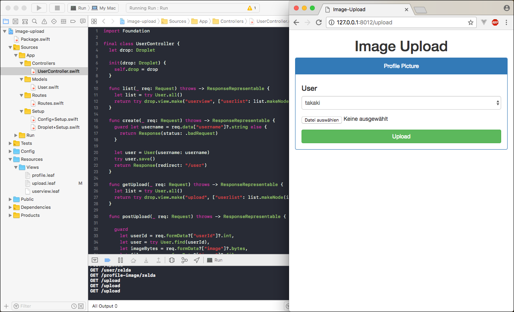

  <h2>Image Upload 👨🏼‍💻 </h2>
  <h3>Tutorial to build this project</h3>
  <h4><a href="https://medium.com/@martinlasek/tutorial-how-to-implement-image-upload-f8ef5a2af869">How to implement Image-Upload</a></h4>
   
  

## Community 🚀
Join the awesome and welcoming Vapor community in <a href="http://vapor.team/"><b>Slack!</b></a>
